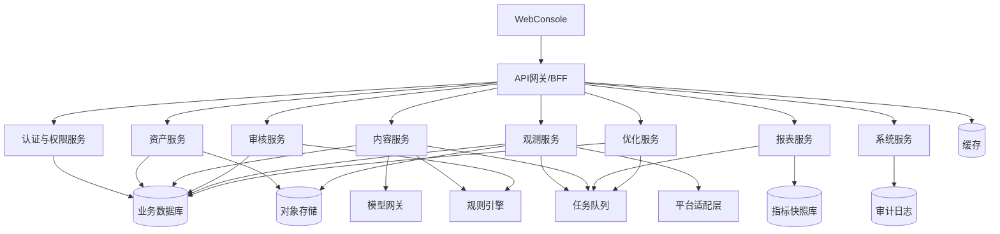

# GEO 智能体 MVP 功能清单 + 页面信息架构 + 技术架构草案

## 1. 文档目的

本文档基于 `D:\GEO\GEO智能体_产品蓝图_立项研发版.md` 继续向下拆解，目标是把产品蓝图转化为一份可以直接用于产品、设计、前后端和测试对齐的执行文档。本文档聚焦 3 个问题：

- MVP 到底做什么，不做什么，优先级如何排序
- 产品控制台应该有哪些页面，页面之间如何流转
- 技术上如何拆服务、数据和任务链路，才能较稳妥地支撑首期闭环

## 2. 对齐结论

GEO 智能体首期不追求“大而全平台”，而是聚焦以下最小可成交闭环：

`客户接入 -> 资产治理 -> 内容生成/改写 -> 审核导出 -> 外部观测 -> 报告与诊断 -> 工单 -> 复测`

因此，MVP 设计和研发必须围绕这条链路收敛，所有功能都要回答两个问题：

1. 是否直接支撑该闭环成立
2. 是否直接影响试点客户接入、使用或验收

## 3. MVP 功能清单

### 3.1 优先级定义

| 优先级 | 含义 | 立项原则 |
| --- | --- | --- |
| P0 | 不做则闭环无法成立 | 必须进入 MVP |
| P1 | 不做闭环可运行，但试点体验明显受损 | 视周期择优纳入 |
| P2 | 对商业化和扩展有价值，但不影响首期验证 | 延后到 Beta/正式版 |

### 3.2 MVP 功能总览

| 模块 | P0 | P1 | P2 |
| --- | --- | --- | --- |
| 组织与权限 | 组织、用户、角色、品牌级隔离 | 操作日志查询 | 更细粒度字段权限 |
| 资产中心 | 品牌、产品、FAQ、术语、证据 CRUD | 批量导入模板、完整性评分 | 高级行业字段模板市场 |
| 内容中心 | 内容生成、改写、内容版本、diff | 批量任务、内容片段复用 | 多模型 A/B 和自动优化 |
| 审核与分发 | 规则审核、人工审批、导出 | 预览链接、导出命名规范 | 多级审批流、外部协同 |
| 观测中心 | 题库管理、观测任务、样本保存 | 截图快照、人工复标 | 多平台扩展和复杂采样策略 |
| 看板与报告 | 基础指标卡、趋势、异常问题 | 周报/月报导出 | 自定义报表中心 |
| 优化中心 | 诊断建议、工单、复测记录 | 置信度、优先级排序 | 自动执行型建议 |
| 系统基础 | 模型配置、通知、备份、敏感信息加密 | 告警面板 | API 开放、私有部署增强 |

### 3.3 P0 功能清单

#### 3.3.1 组织与权限

| 功能项 | 描述 | 输入 | 输出 | 依赖 |
| --- | --- | --- | --- | --- |
| 组织管理 | 创建组织、租户隔离 | 组织信息 | 组织主体 | 无 |
| 用户管理 | 创建用户、启停用户 | 账号信息 | 用户主体 | 组织管理 |
| 角色权限 | 超管、品牌管理员、内容运营、审核员、只读访客 | 角色配置 | 菜单和数据权限 | 用户管理 |
| 品牌级数据隔离 | 按组织/品牌隔离资产、样本、工单 | 请求上下文 | 过滤后的数据访问 | 组织管理 |

#### 3.3.2 资产中心

| 功能项 | 描述 | 输入 | 输出 | 验收点 |
| --- | --- | --- | --- | --- |
| 品牌资料管理 | 维护品牌基本信息、定位、标签、禁用语 | 表单/导入文件 | Brand | 支持版本记录 |
| 产品资料管理 | 维护产品参数、场景、边界、交付方式 | 表单/导入文件 | Product | 支持自定义参数 JSON |
| FAQ 管理 | 维护问答、适用范围、风险等级、证据挂接 | FAQ 数据 | FAQ | 可关联证据 |
| 术语与禁用语 | 统一品牌术语、别名和不建议表达 | 词条数据 | Term | 供生成与审核复用 |
| 证据库 | 管理官网、资质、白皮书、检测报告等证据 | URL/文件 | Evidence | 标记权威等级和可引用性 |
| 资产导入导出 | 导入初始资料、导出标准化资产 | Excel/Word/Markdown/TXT | 标准化实体 | 能支撑 onboarding |

#### 3.3.3 内容中心

| 功能项 | 描述 | 输入 | 输出 | 验收点 |
| --- | --- | --- | --- | --- |
| 内容生成 | 基于模板和资产生成品牌/产品内容 | 品牌、产品、模板、参数 | 内容初稿 | 至少支持 6 类内容类型 |
| 内容改写 | 对已有文案做 GEO 友好化改写 | 原始文案 | 优化稿 | 保留原文和改写稿 |
| 内容版本管理 | 记录每次生成、改写、审核后的版本 | 内容任务 | ContentVersion | 可回溯 |
| diff 对比 | 展示原文和改写稿差异 | 两个版本文本 | 差异视图 | 审核可用 |
| 内容任务管理 | 跟踪任务状态和执行结果 | 用户触发任务 | 任务状态 | 支持失败重试 |

#### 3.3.4 审核与分发

| 功能项 | 描述 | 输入 | 输出 | 验收点 |
| --- | --- | --- | --- | --- |
| 规则审核 | 识别敏感词、绝对化表达、品牌禁用语 | 文本 + 规则库 | 审核报告 | 分为必须修正/建议修正/人工确认 |
| 人工审批 | 审核员查看内容、批注、通过或退回 | 内容版本 | 审批记录 | 审批链可追溯 |
| 渠道模板 | 官网、帮助中心、公众号、销售资料等模板 | 模板配置 | 渠道化内容结构 | 首期先做固定模板 |
| 内容导出 | 导出为 Word/Markdown/HTML/TXT | 内容版本 | 导出文件 | 命名可包含品牌和日期 |

#### 3.3.5 观测中心

| 功能项 | 描述 | 输入 | 输出 | 验收点 |
| --- | --- | --- | --- | --- |
| 标准题库管理 | 维护品牌认知、购买建议、竞品比较等问题集 | 题目配置 | ObservationQuestion | 支持品牌/产品/优先级标签 |
| 观测任务管理 | 按平台、周期执行问题采样 | 平台 + 题库 + 周期 | ObservationTask | 可周/月执行 |
| 样本保存 | 保存原始问题、原始回答、时间、平台信息 | 平台返回结果 | ObservationSample | 样本可回放 |
| 自动标注 | 判断提及、首提、错误、引用等指标 | 样本 + 规则 | SampleLabel | 支持人工后修正 |
| 指标计算 | 生成提及率、首提率、错误率等 | 样本标签 | MetricSnapshot | 支持时间区间统计 |

#### 3.3.6 看板与报告

| 功能项 | 描述 | 输入 | 输出 | 验收点 |
| --- | --- | --- | --- | --- |
| 首页指标卡 | 总体提及率、首提率、错误率、引用率 | 指标快照 | Dashboard Summary | 可按品牌/平台切换 |
| 趋势看板 | 时间趋势和问题类型分布 | MetricSnapshot | 趋势图 | 可周/月查看 |
| 异常问题列表 | 表现最差、新增错误、长期未命中问题 | 样本 + 指标 | 异常列表 | 可 drill down 到样本 |
| 基线报告 | 输出第一次观测结果摘要 | 基线快照 | 报告页/导出内容 | 支撑试点汇报 |

#### 3.3.7 优化中心

| 功能项 | 描述 | 输入 | 输出 | 验收点 |
| --- | --- | --- | --- | --- |
| 自动诊断 | 根据样本和规则判断可能原因 | 异常样本 | 诊断结果 | 归因需可解释 |
| 优化建议 | 给出补 FAQ、改参数页、补证据等建议 | 诊断结果 | 建议清单 | 可操作 |
| 工单管理 | 建议转工单、分配负责人、跟踪状态 | 建议 + 指派信息 | OptimizationTicket | 可跟踪状态 |
| 复测记录 | 工单完成后再观测并比对结果 | 工单 + 新样本 | 复测记录 | 支撑闭环证明 |

#### 3.3.8 系统基础

| 功能项 | 描述 | 输入 | 输出 | 验收点 |
| --- | --- | --- | --- | --- |
| 模型配置 | 配置生成模型、嵌入模型、环境参数 | 配置项 | 模型调用配置 | 加密存储 |
| 通知提醒 | 审核提醒、异常提醒、工单到期提醒 | 事件 | 站内消息/邮件 | 可配置开关 |
| 操作日志 | 记录登录、导出、删除、配置变更 | 系统事件 | Audit Log | 支持查询 |
| 基础备份 | 资产、工单、样本备份 | 定时任务 | 备份记录 | MVP 最小可用 |

### 3.4 P1 功能清单

| 模块 | 功能项 | 进入条件 |
| --- | --- | --- |
| 资产中心 | 资料完整性评分、缺失提醒面板 | 若试点客户资料质量参差不齐，建议纳入 |
| 内容中心 | 批量任务面板、内容片段复用库 | 若运营团队内容产量较大，建议纳入 |
| 审核与分发 | 预览链接、导出命名规范 | 若跨团队评审频繁，建议纳入 |
| 观测中心 | 截图快照、人工复标工作台 | 若观测误差较高，建议纳入 |
| 看板与报告 | 周报/月报导出 | 若管理汇报频率高，建议纳入 |
| 优化中心 | 建议优先级和置信度评分 | 若建议过多，需要排序时纳入 |
| 接入工作台 | onboarding 向导、行业模板初始化 | 若实施团队人力有限，建议纳入 |

### 3.5 P2 功能清单

| 模块 | 功能项 | 说明 |
| --- | --- | --- |
| 模板市场 | 行业模板市场、模板共享 | 依赖行业交付沉淀 |
| 平台扩展 | 更多 AI 平台和复杂采样策略 | 平台适配成本高 |
| 协作增强 | 多级审批、多人外部协作 | MVP 可以手动绕过 |
| 开放能力 | API、Webhook、私有部署 | 更适合商用后期 |
| 高级分析 | 竞品覆盖、舆情联动、内容覆盖分析 | 属于二期价值提升 |
| 多语言 | 海外 GEO、多语言内容输出 | 当前非核心市场 |

## 4. 页面信息架构

### 4.1 页面 IA 总览

```mermaid
flowchart TB
    login[登录页]
    login --> home[工作台首页]
    home --> onboarding[接入工作台]
    home --> assetHub[资产中心]
    home --> contentHub[内容中心]
    home --> reviewHub[审核中心]
    home --> observeHub[观测中心]
    home --> dashboardHub[看板中心]
    home --> optimizeHub[优化中心]
    home --> adminHub[系统中心]

    onboarding --> brandImport[品牌接入]
    onboarding --> templateInit[模板初始化]

    assetHub --> brandPage[品牌资料页]
    assetHub --> productPage[产品资料页]
    assetHub --> faqPage[FAQ页]
    assetHub --> termPage[术语页]
    assetHub --> evidencePage[证据库页]

    contentHub --> createTask[生成任务页]
    contentHub --> rewriteTask[改写任务页]
    contentHub --> contentDetail[内容详情页]

    reviewHub --> reviewList[审核列表页]
    reviewHub --> reviewDetail[审核详情页]

    observeHub --> questionBank[问题集页]
    observeHub --> observeTask[观测任务页]
    observeHub --> samplePage[样本详情页]

    dashboardHub --> overviewPage[总览看板]
    dashboardHub --> trendPage[趋势分析页]
    dashboardHub --> issuePage[异常问题页]

    optimizeHub --> diagnosisPage[建议列表页]
    optimizeHub --> ticketPage[工单列表页]
    optimizeHub --> retestPage[复测对比页]

    adminHub --> userRolePage[用户角色页]
    adminHub --> modelConfigPage[模型配置页]
    adminHub --> logPage[日志审计页]
```

### 4.2 一级导航建议

| 一级导航 | 二级页面 | 核心使用者 | 说明 |
| --- | --- | --- | --- |
| 首页 | 工作台总览、待办提醒 | 全角色 | 展示品牌状态、待审核、待处理工单、最近观测结果 |
| 接入工作台 | 组织配置、品牌接入、行业模板、导入向导 | 管理员、实施、品牌管理员 | 首次接入和新增品牌时使用 |
| 资产中心 | 品牌、产品、FAQ、术语、证据 | 内容运营、产品营销 | 沉淀品牌内容资产 |
| 内容中心 | 生成任务、改写任务、内容详情 | 内容运营 | 日常生产主入口 |
| 审核中心 | 审核列表、审核详情 | 审核员、法务 | 控制风险和审批流 |
| 观测中心 | 问题集、观测任务、样本详情 | 运营、品牌负责人 | 采集品牌外部表现 |
| 看板中心 | 总览、趋势、异常、报告 | 管理层、运营 | 汇报和决策入口 |
| 优化中心 | 诊断建议、工单、复测 | 内容运营、品牌负责人 | 驱动闭环执行 |
| 系统中心 | 用户角色、模型配置、通知、日志、备份 | 管理员 | 保证可运行性 |

### 4.3 页面级拆解

#### 4.3.1 工作台首页

目标：让不同角色一登录就知道当前系统状态和下一步动作。

核心区块：
- 品牌 AI 可见性总览
- 待补资料提醒
- 待审核内容
- 最新观测结果和异常问题
- 待处理工单
- 最近导出和报告

关键交互：
- 从异常问题直接跳转到样本详情
- 从待审核直接跳转到审核详情
- 从待补资料跳转到对应资产页

#### 4.3.2 接入工作台

目标：降低首个品牌接入成本。

核心页面：
- 组织与品牌创建
- 行业模板选择
- 资料导入向导
- 完整性评分结果
- 基线观测启动页

关键交互：
- 导入后给出字段映射检查
- 缺失项提醒可一键跳转补录
- 完成接入后触发基线观测

#### 4.3.3 资产中心

目标：成为所有内容生成与观测判断的单一可信来源。

关键页面结构：
- 左侧实体导航：品牌、产品、FAQ、术语、证据
- 中间列表：筛选、搜索、批量操作
- 右侧详情抽屉/详情页：字段编辑、关联关系、版本历史

关键交互：
- FAQ 详情可直接选择证据挂接
- 品牌/产品详情页显示资料完整性状态
- 证据库支持文件和 URL 双模式

#### 4.3.4 内容中心

目标：为内容运营提供高频工作台。

关键页面：
- 生成任务创建页
- 改写任务创建页
- 内容任务列表
- 内容详情页

内容详情页建议信息区：
- 基础信息：品牌、产品、模板、渠道、创建人、模型版本
- 原始输入区
- 输出结果区
- diff 对比区
- 审核结果区
- 导出操作区

#### 4.3.5 审核中心

目标：把模型生成内容纳入可管控流程。

关键页面：
- 审核列表页
- 审核详情页

审核详情页建议结构：
- 内容预览
- 风险命中列表
- 规则说明
- 证据引用区
- 审核意见
- 操作按钮：通过、退回、标记人工确认

#### 4.3.6 观测中心

目标：建立标准题库和样本资产。

关键页面：
- 问题集管理页
- 观测任务页
- 样本列表页
- 样本详情页

样本详情页建议结构：
- 问题原文
- 平台回答原文
- 快照信息
- 自动标注结果
- 人工复核结果
- 关联指标和工单

#### 4.3.7 看板中心

目标：支撑管理决策和客户汇报。

关键页面：
- 总览页
- 趋势页
- 异常问题页
- 报告导出页

总览页建议指标卡：
- 总体提及率
- 首提率
- 事实一致率
- 显式引用率
- 错误率
- 竞品出现率

#### 4.3.8 优化中心

目标：让异常问题真正转成行动。

关键页面：
- 建议列表页
- 工单列表页
- 工单详情页
- 复测对比页

工单详情页建议结构：
- 来源样本
- 问题归因
- 建议动作
- 负责人和截止时间
- 执行记录
- 复测结果

### 4.4 核心用户旅程

## 5. 技术架构草案

### 5.1 设计原则

- 业务主链路优先，避免一开始过度微服务化
- 先按领域服务拆分，再按部署压力决定是否独立部署
- 所有长耗时任务后台异步化
- 模型调用统一走网关，避免业务服务直接耦合模型供应商
- 观测能力抽象为平台适配层，避免平台逻辑散落在各处
- 样本、指标、审计分开建模，保证后续扩展

### 5.2 推荐逻辑架构

### 5.3 服务拆分建议

| 服务 | 建议阶段 | 主要职责 | MVP 形态 |
| --- | --- | --- | --- |
| BFF/API 网关 | P0 | 前端聚合接口、鉴权、菜单权限上下文 | 独立模块 |
| 认证与权限服务 | P0 | 登录、用户、角色、组织、访问控制 | 独立模块 |
| 资产服务 | P0 | 品牌、产品、FAQ、术语、证据、导入导出 | 独立模块 |
| 内容服务 | P0 | 生成、改写、内容版本、任务状态 | 独立模块 |
| 审核服务 | P0 | 规则执行、审批记录、风险等级 | 可与内容服务同仓 |
| 观测服务 | P0 | 题库、观测任务、样本、自动标注 | 独立模块 |
| 报表服务 | P0 | 指标聚合、看板、报告导出 | 可与观测服务同仓 |
| 优化服务 | P0 | 诊断建议、工单、复测比对 | 独立模块 |
| 系统服务 | P0 | 模型配置、通知、备份、审计 | 独立模块 |
| 规则引擎 | P1 | 敏感词、禁用语、归因规则统一执行 | 先做内部组件 |
| 模型网关 | P0 | 模型供应商适配、调用日志、回退 | 独立模块 |
| 平台适配层 | P0 | 不同外部 AI 平台观测适配 | 先做插件式适配器 |

### 5.4 数据存储建议

| 存储类型 | 用途 | 建议数据 |
| --- | --- | --- |
| 关系型数据库 | 核心业务实体 | 组织、品牌、产品、FAQ、工单、审核记录 |
| 对象存储 | 文件与快照 | 白皮书、证据文件、样本截图、导出文件 |
| 指标快照库 | 汇总统计 | 日/周/月指标、趋势数据、报表中间结果 |
| 缓存 | 高频查询与会话 | 登录态、品牌上下文、看板热点数据 |
| 审计日志存储 | 安全与追溯 | 登录、导出、删除、配置变更、权限变更 |

### 5.5 核心数据流

#### 5.5.1 内容生成流

1. 前端发起生成任务。
2. BFF 校验权限和品牌上下文。
3. 内容服务读取品牌资产和模板。
4. 模型网关组装提示并调用模型。
5. 结果写入内容版本表。
6. 规则引擎执行初步审核。
7. 返回内容详情页，待进一步人工审核。

#### 5.5.2 观测采样流

1. 定时任务创建观测任务。
2. 观测服务按平台和题库切分子任务。
3. 平台适配层执行采样并回传原始回答。
4. 样本写入样本表和对象存储。
5. 自动标注模块计算标签。
6. 报表服务汇总生成指标快照。
7. 异常问题触发优化建议任务。

#### 5.5.3 优化闭环流

1. 优化服务读取异常样本和规则。
2. 生成建议并展示给运营。
3. 用户确认后生成工单。
4. 工单完成后回写执行记录。
5. 复测任务重新观测同类问题。
6. 系统输出前后对比结果。

### 5.6 异步任务与队列设计

| 任务类型 | 触发方式 | 说明 |
| --- | --- | --- |
| 内容生成任务 | 用户触发 | 防止长耗时阻塞前端 |
| 内容改写任务 | 用户触发 | 与生成共用队列机制 |
| 观测任务 | 定时/手动触发 | 按平台和题目切片 |
| 自动标注任务 | 观测后触发 | 样本到标签的异步处理 |
| 指标汇总任务 | 标注后触发 | 生成日/周/月快照 |
| 报告导出任务 | 用户触发 | 文档导出放后台执行 |
| 证据巡检任务 | 定时触发 | 检查链接是否失效 |
| 通知任务 | 事件触发 | 审核、异常、工单到期提醒 |

### 5.7 模型网关设计建议

模型网关必须统一处理以下逻辑：

- 模型供应商配置和密钥管理
- 环境区分：测试/生产
- Prompt 模板注入
- 调用超时、重试和回退策略
- 成本和调用日志记录
- 输出安全过滤

建议暴露统一能力接口：

- `generateContent()`
- `rewriteContent()`
- `summarizeEvidence()`
- `classifySample()`

### 5.8 平台适配层建议

平台适配层建议采用适配器模式，每个平台最少实现以下能力：

- `prepareQuestion()`
- `executeObservation()`
- `normalizeResponse()`
- `captureSnapshot()`
- `healthCheck()`

这样可以把平台差异控制在适配器内部，避免观测服务主逻辑被平台细节污染。

### 5.9 接口边界建议

#### 前端直连禁止项

- 前端不得直接调用模型供应商
- 前端不得直接访问平台适配器
- 前端不得直接读写对象存储

#### 服务边界建议

- 资产服务不负责指标计算
- 内容服务不负责工单流转
- 观测服务不直接做报表展示逻辑
- 报表服务只消费标准化样本和指标数据
- 优化服务只消费异常结果，不直接采样

### 5.10 安全与合规底线

| 领域 | MVP 要求 |
| --- | --- |
| 租户隔离 | 按组织隔离数据访问 |
| 配置安全 | 模型 key 密文存储，不明文展示 |
| 文件安全 | 证据和导出文件带访问权限控制 |
| 审计追溯 | 登录、导出、删除、权限变更留痕 |
| 内容合规 | 敏感词、禁用语、行业规则支持 |
| 观测合规 | 平台接入前需法务确认使用边界 |

## 6. 产品与研发对齐建议

### 6.1 产品团队本周需要明确的事项

- 首期试点行业和首批客户画像
- P0 内容类型清单，建议先冻结为 6 类
- 首批接入平台范围，建议不超过 3 个
- 观测指标定义口径和异常阈值
- 审核规则首版词库范围

### 6.2 设计团队优先输出的原型

- 接入工作台
- 资产中心
- 内容详情页
- 审核详情页
- 样本详情页
- 总览看板
- 工单详情页

### 6.3 后端团队优先设计的接口和表

- 组织/用户/角色接口与权限模型
- Brand/Product/FAQ/Evidence/Term 核心表
- ContentTask/ContentVersion/ReviewRecord 表
- ObservationTask/ObservationSample/SampleLabel 表
- MetricSnapshot/OptimizationTicket 表
- 模型网关和平台适配接口

### 6.4 前端团队优先搭建的框架

- 登录和品牌上下文切换
- 一级导航与控制台骨架
- 表格 + 详情抽屉/详情页复用框架
- diff 组件、审核批注组件、看板卡片组件

### 6.5 测试团队优先准备的场景

- 组织和品牌隔离测试
- 资产导入和证据挂接测试
- 内容生成到审核的主链路测试
- 观测任务到指标生成的链路测试
- 工单和复测闭环测试
- 审计日志和权限回归测试

## 7. 建议的对齐会议议程

| 环节 | 时长建议 | 输出 |
| --- | --- | --- |
| 产品目标与边界确认 | 15 分钟 | 确认非承诺与 MVP 范围 |
| MVP 功能清单过表 | 25 分钟 | 冻结 P0/P1 |
| 页面 IA 评审 | 20 分钟 | 确认核心页面和跳转 |
| 技术架构评审 | 25 分钟 | 确认服务拆分、队列、模型网关、适配层 |
| 数据与接口优先级确认 | 20 分钟 | 输出首批表结构和接口名单 |
| 风险与排期确认 | 15 分钟 | 确认阻塞项和阶段目标 |

## 8. 最终建议

产品和研发在首期最容易失焦的点有两个：一是功能铺得过宽，二是过早追求平台扩展和高级能力。首期务必围绕 `接入 -> 生产 -> 审核 -> 观测 -> 优化 -> 复测` 这条链路冻结范围。

如果这份文档要继续向下推进，下一步最合适的产物不是继续写 PRD，而是：

1. `字段级数据字典`
2. `核心页面低保真原型`
3. `领域表结构与接口清单`
4. `MVP 研发迭代排期表`
