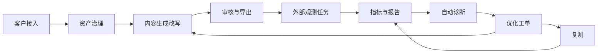
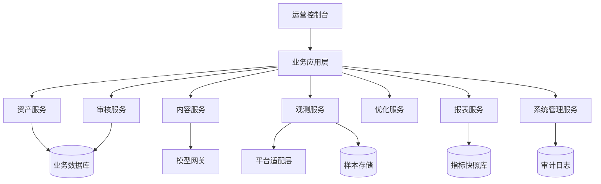

# GEO 智能体产品蓝图

## 1. 文档定位

本文档用于将现有 `BrandMention GEO 智能体产品需求文档（可落地版）` 重组为一份更适合内部立项评审、研发拆解、设计协同和交付准备的产品蓝图。蓝图强调以下原则：

- 以企业侧可控能力为主，不承诺第三方公共模型的内部收录、排序和推荐结果。
- 以 `内容资产治理 + 内容生产 + 外部观测 + 优化闭环` 为核心链路，不把资源投入到不可验证的黑盒承诺能力。
- 以 MVP 可交付为第一目标，先验证产品闭环，再逐步扩展行业模板、协作能力和高级分析。

## 2. 一句话定义

GEO 智能体是一款面向中国大陆企业市场的 `品牌 AI 可见性运营平台`，帮助品牌方把分散资料沉淀为机器可读的内容资产，并通过内容生成、审核发布、外部 AI 问答观测和优化工单闭环，持续提升品牌在主流生成式问答场景中的可见性、准确性和可引用性。

## 3. 立项摘要

### 3.1 业务问题

在中国大陆市场，越来越多用户通过豆包、Kimi、通义、文心、元宝、智谱、星火等生成式产品获取品牌、产品、选型和采购建议。品牌方当前面临的核心问题不是“没有内容”，而是：

- 资料分散在官网、PPT、白皮书、客服话术和销售材料中，缺少统一结构。
- AI 问答场景中常出现未提及、提错、竞品替代、证据不足和表述不一致。
- 团队没有成熟 GEO 工作流，无法形成持续观测、归因和优化机制。
- 市场上大量方案依赖不可控的第三方平台机制，难以承诺、难以验收、难以交付。

### 3.2 产品价值

产品价值聚焦 4 个层面：

- `可控`：企业掌握自己的品牌资产、模板、题库、规则和流程。
- `可证`：观测指标、内容来源、证据链和优化建议可追溯。
- `可复用`：内容资产可同时服务官网、帮助中心、公众号、销售和知识库。
- `可交付`：产品能力可打包成 SaaS 订阅、实施服务和行业模板方案。

### 3.3 立项结论

该产品适合按 `SaaS 产品 + 实施服务` 方式立项，优先服务中大型企业品牌团队、内容团队、代理运营团队和售前/客户成功团队。MVP 目标是验证业务闭环，而不是追求全渠道覆盖或复杂行业扩展。

## 4. 产品定位与边界

### 4.1 产品定位

GEO 智能体不是“控制第三方大模型答案”的工具，而是企业侧 `AI 可见性运营底座`。系统通过品牌内容资产治理、结构化内容生产、外部问答观测和优化工单流，提升品牌信息被模型识别、正确提及和被权威信源支持的概率。

### 4.2 非目标与非承诺

以下能力明确不纳入产品承诺：

- 不承诺第三方公共大模型一定收录客户内容。
- 不承诺品牌提及率、首提率、引用率提升到固定数值。
- 不承诺查询第三方平台内部“已收录/未收录/权重变化”状态。
- 不承诺通过客户配置平台 API key 获取平台内部索引、审核或排序数据。
- 不承诺消除所有外部模型幻觉，仅提供识别、校验、证据补强和修正建议。

### 4.3 产品边界表

| 维度 | 纳入范围 | 不纳入范围 |
| --- | --- | --- |
| 资产治理 | 品牌资料、产品资料、FAQ、术语、证据、禁用语 | 第三方平台内部知识图谱 |
| 内容生产 | 生成、改写、结构化、审核、导出 | 保证外部模型直接采用 |
| 分发适配 | 官网、帮助中心、公众号、知识库、PDF、销售材料 | 自动投稿至公共模型平台 |
| 监测分析 | 标准题库观测、样本保存、指标计算、人工复核 | 第三方平台内部收录状态查询 |
| 优化闭环 | 归因分析、优化建议、工单流、复测追踪 | 保证固定比例结果改善 |

## 5. 目标客户与使用角色

### 5.1 目标客户

- 有明确品牌建设和内容运营预算的中大型企业
- 同时服务多个客户的 GEO/SEO 代理团队
- 需要长期维护官网、知识库、FAQ 和销售材料的产品型企业

### 5.2 核心角色

| 角色 | 核心目标 | 主要使用模块 |
| --- | --- | --- |
| 品牌市场负责人 | 看品牌在 AI 问答中的整体表现和优化方向 | 看板、报告、优化中心 |
| 内容运营 | 快速产出合规、结构化、可复用内容 | 资产中心、内容中心、分发中心 |
| 产品营销经理 | 统一产品信息和参数表述 | 资产中心、内容中心 |
| 审核/法务 | 控制对外内容风险 | 审核中心、规则库 |
| 代理团队 | 多客户模板化交付与运营 | 多品牌工作台、观测中心、报表中心 |
| 客户成功/售前 | 复用标准内容快速应答 | 资产中心、内容导出 |

## 6. 成功标准

### 6.1 MVP 成功标准

- 完成 `品牌资产治理 -> 内容生产 -> 审核导出 -> 标准题库观测 -> 优化建议 -> 工单 -> 复测` 闭环。
- 支持至少 1 个试点行业、3 个试点客户完成 onboarding 和首轮基线报告。
- 核心用户可在系统内独立完成资料录入、内容生成、一次观测和一次优化工单闭环。
- 所有核心模块具备最小权限、日志和版本记录能力。

### 6.2 核心指标

| 指标类别 | 指标 | 说明 |
| --- | --- | --- |
| 资产完整性 | 品牌资料完整率、FAQ 挂证率、证据有效率 | 衡量输入质量 |
| 生产效率 | 单篇内容生成耗时、改写耗时、审核通过率 | 衡量运营效率 |
| 观测质量 | 题库覆盖率、观测成功率、人工复核差异率 | 衡量观测可用性 |
| 运营闭环 | 工单关闭率、复测完成率、高优问题修复周期 | 衡量执行力 |
| 商业交付 | 试点客户启动周期、模板复用率、报告交付效率 | 衡量产品化程度 |

## 7. 核心业务闭环

### 7.1 闭环说明

1. 客户完成组织、品牌、产品、FAQ 和证据接入。
2. 内容运营基于结构化资产生成内容初稿或对存量内容做 GEO 改写。
3. 系统执行规则审核，高风险内容进入人工审批。
4. 内容导出到官网、帮助中心、公众号、销售和知识库等渠道。
5. 系统按标准问题集在主流 AI 平台执行观测任务并沉淀样本。
6. 系统计算指标、识别异常、输出表现报告。
7. 用户接受优化建议后转成工单，再次补强内容并复测，形成迭代。

## 8. MVP 范围划分

### 8.1 必须做

这些能力决定核心闭环是否成立，必须进入首期立项范围。

| 模块 | MVP 必须做 | 说明 |
| --- | --- | --- |
| 组织与权限 | 组织、用户、角色、品牌级权限 | 支撑企业试点和基础隔离 |
| 资产中心 | 品牌库、产品库、FAQ、术语库、证据库 | 所有后续能力的数据底座 |
| 数据治理 | 导入、编辑、版本记录、完整性校验 | 保证输入质量 |
| 内容中心 | 内容生成、内容改写、diff 对比、批量任务 | 支撑主要运营场景 |
| 审核中心 | 规则审核、人工审批、审核记录 | 保证合规和责任可追溯 |
| 分发中心 | 渠道模板、导出 Word/Markdown/HTML/TXT | 支撑发布执行 |
| 观测中心 | 标准题库、平台任务、样本保存、自动标注 | 核心差异化能力 |
| 指标看板 | 提及率、首提率、事实一致率、错误率等 | 用于对内外汇报 |
| 优化中心 | 自动诊断、优化建议、工单、复测记录 | 构成闭环 |
| 系统能力 | 日志、通知、模型配置、敏感信息加密、基础备份 | 最小可用企业能力 |

### 8.2 建议做

这些能力不影响闭环成立，但显著提升试点体验和交付效率，适合在 MVP 中择优纳入。

| 模块 | 建议做 | 价值 |
| --- | --- | --- |
| 分发中心 | 共享预览链接、导出命名规范 | 提升跨团队协作效率 |
| 观测中心 | 截图快照、人工二次标注台 | 提升复核准确性 |
| 优化中心 | 问题优先级排序、建议置信度 | 提高建议可执行性 |
| 交付能力 | onboarding 指引、行业模板初始化 | 降低试点接入成本 |
| 报表能力 | 周报/月报导出 | 提升管理层汇报效率 |

### 8.3 延后做

这些能力可作为 Beta 或正式版扩展，不建议首期研发投入。

| 模块 | 延后做 | 原因 |
| --- | --- | --- |
| 行业扩展 | 复杂行业规则库、深度行业模板市场 | 依赖试点沉淀 |
| 竞争分析 | 高级竞品覆盖分析、舆情联动 | 不是 MVP 闭环必要项 |
| 平台扩展 | 更多观测平台和复杂自动化适配 | 平台适配成本高 |
| 协作扩展 | 多级审批流、外部团队多人协同 | 首期可简化 |
| 能力开放 | API、私有部署、内部 RAG 深度集成 | 商业化后期能力 |
| 多语言能力 | 海外市场、多语言内容产出 | 当前市场聚焦中国大陆 |

## 9. 产品蓝图

### 9.1 战略层

#### 9.1.1 市场问题定义

企业在传统 SEO 和内容建设之外，新增了一个需要持续经营的新阵地，即生成式 AI 问答场景。该场景需要更结构化、更统一、更可验证的内容基础设施，而不是一次性投放或零散文案优化。

#### 9.1.2 核心价值主张

- 为品牌提供统一的 AI 友好内容资产底座
- 为运营团队提供标准化内容生产和审核工具
- 为管理层提供可量化的品牌 AI 可见性观测
- 为交付团队提供可复用的模板、题库、报告和流程

#### 9.1.3 商业模式建议

- `标准版`：基础资产治理、内容生产、简化观测
- `专业版`：多品牌、多角色、报表、工单和批量任务
- `旗舰版`：行业模板、定制规则、私有部署/API、实施服务
- `代理版`：多客户工作台、客户隔离、子账号与模板复用

### 9.2 产品层

#### 9.2.1 核心页面/workbench

| 工作台 | 关键页面 | 核心目标 |
| --- | --- | --- |
| 接入工作台 | 组织创建、品牌接入、模板选择、资料完整性评分 | 快速完成试点上线 |
| 资产中心 | 品牌库、产品库、FAQ、证据库、术语库 | 建立统一内容资产 |
| 内容中心 | 生成任务、改写任务、diff 对比、批量导出 | 高效产出内容 |
| 审核中心 | 规则命中、风险等级、人工审批、退回记录 | 保证合规 |
| 观测中心 | 问题集、观测任务、样本列表、人工标注 | 采集外部表现 |
| 看板中心 | 平台趋势、问题表现、异常提醒、报告导出 | 支持决策和汇报 |
| 优化中心 | 诊断建议、工单列表、复测结果 | 推动迭代执行 |
| 系统中心 | 权限、模型配置、通知、日志、备份 | 保证稳定运行 |

#### 9.2.2 六大模块蓝图

##### A. 资产中心

目标：沉淀结构化、可复用、可校验的品牌知识资产。

输入：
- 品牌资料
- 产品/服务资料
- FAQ
- 术语和禁用语
- 证据文件、URL、白皮书、资质等

核心能力：
- 多品牌、多产品管理
- 参数模板和行业字段扩展
- Excel/Word/Markdown/TXT 导入导出
- 资料完整性评分和缺失提醒
- 版本记录和更新审计

输出：
- 标准化品牌资产
- 可供生成、审核、观测使用的数据底座

验收点：
- 能支持至少 3 个试点客户完成完整资产接入
- FAQ 和高风险内容支持证据挂接

##### B. 内容中心

目标：在品牌资产约束下，批量生成 GEO 友好内容。

输入：
- 品牌资产
- 内容类型
- 目标受众
- 目标渠道
- 风格和长度参数

核心能力：
- 内容生成
- 存量内容改写
- 参数表、FAQ、摘要和结论段抽取
- diff 对比和版本回溯
- 批量任务执行

输出：
- 初稿内容
- 优化稿内容
- 结构化内容片段

验收点：
- 支持至少 6 类核心内容生成和改写
- 批量任务可异步处理并反馈进度

##### C. 审核与分发中心

目标：让内容可合规、可导出、可进入可运营渠道。

输入：
- 内容初稿或优化稿
- 审核规则
- 渠道模板

核心能力：
- 规则审核和风险分级
- 人工审批和退回修改
- 多格式导出
- 渠道模板适配
- 发布建议

输出：
- 审核报告
- 可分发内容成品

验收点：
- 审核结果可追溯到规则和审核人
- 导出文件命名规范可配置

##### D. 观测中心

目标：围绕标准问题集形成可量化的外部 AI 表现观测。

输入：
- 问题集
- 观测平台
- 采样周期
- 标注规则

核心能力：
- 标准题库管理
- 平台观测任务编排
- 原始回答、文本快照、截图存档
- 自动标注与人工复核
- 指标计算和趋势展示

输出：
- 观测样本
- 指标快照
- 异常问题列表

验收点：
- 支持按品牌、产品、平台、时间区间查看表现
- 样本与指标之间具备可追溯关联

##### E. 优化中心

目标：把观测数据转成运营动作。

输入：
- 异常样本
- 诊断规则
- 优化建议模板

核心能力：
- 问题归因
- 优化建议生成
- 工单创建、分配、状态跟踪
- 复测结果回填

输出：
- 优化建议
- 优化工单
- 闭环结果记录

验收点：
- 任一异常问题可追溯到建议、执行人和复测结果

##### F. 系统中心

目标：提供企业级最小可用基础设施。

输入：
- 组织与角色配置
- 模型和服务配置
- 通知规则

核心能力：
- 租户和角色权限
- 配置加密存储
- 调用日志和操作审计
- 站内通知和邮件提醒
- 基础备份与恢复

输出：
- 稳定、合规、可审计的运行环境

验收点：
- 支持租户隔离、角色分权和关键操作日志查询

### 9.3 系统层

#### 9.3.1 逻辑架构

#### 9.3.2 服务划分建议

| 服务 | 主要职责 |
| --- | --- |
| 资产服务 | 品牌、产品、FAQ、术语、证据、导入导出、版本管理 |
| 内容服务 | 内容生成、改写、批量任务、内容版本管理 |
| 审核服务 | 规则库、审核报告、人工审批流、风险分级 |
| 观测服务 | 问题集、任务编排、平台适配、样本采集、标注 |
| 报表服务 | 指标计算、趋势报表、异常聚合、导出 |
| 优化服务 | 归因规则、建议生成、工单、复测记录 |
| 系统服务 | 组织账号、角色权限、通知、日志、配置、备份 |

#### 9.3.3 核心异步任务

下列任务建议从 MVP 起采用队列化或后台任务机制：

- 批量内容生成
- 批量内容改写
- 观测任务执行
- 样本自动标注
- 指标快照计算
- 周报/月报导出
- 证据失效检测
- 通知分发

### 9.4 数据层

#### 9.4.1 核心实体

| 实体 | 关键字段 | 说明 |
| --- | --- | --- |
| Organization | org_id、org_name、plan_type、status | 租户主体 |
| User | user_id、org_id、role_id、status | 用户主体 |
| Brand | brand_id、org_id、brand_name、industry、positioning、status | 品牌资料 |
| Product | product_id、brand_id、category、params_json、scenarios | 产品资料 |
| FAQ | faq_id、brand_id、product_id、question、answer、evidence_ids | 标准问答 |
| Evidence | evidence_id、brand_id、source_type、title、url_or_file、authority_level | 证据对象 |
| Term | term_id、brand_id、term_type、value、status | 术语/禁用语 |
| ContentTask | task_id、brand_id、content_type、channel_type、status、model_version | 生成/改写任务 |
| ContentVersion | content_id、task_id、version_no、source_text、output_text | 内容版本 |
| ReviewRecord | review_id、content_id、reviewer_id、result、risk_level、comment | 审核结果 |
| ObservationQuestion | question_id、brand_id、category、priority、text | 标准问题集 |
| ObservationTask | observation_task_id、brand_id、platform_name、schedule_type、status | 观测任务 |
| ObservationSample | sample_id、question_id、platform_name、answer_text、snapshot_time | 样本结果 |
| SampleLabel | label_id、sample_id、mention_flag、first_mention_flag、error_flag | 自动/人工标注 |
| MetricSnapshot | snapshot_id、brand_id、platform_name、period_start、period_end | 指标快照 |
| OptimizationTicket | ticket_id、brand_id、source_sample_id、owner_id、status | 优化工单 |

#### 9.4.2 关键关系

- 一个组织下可有多个品牌。
- 一个品牌下可有多个产品、FAQ、证据和问题集。
- 一个内容任务可产生多个内容版本。
- 一个观测任务可产生多个观测样本。
- 一个样本可对应自动标注和人工复核结果。
- 一个异常样本可触发一个或多个优化工单。

## 10. 关键任务流

### 10.1 首次接入流

1. 管理员创建组织、用户和品牌。
2. 选择行业模板并导入品牌、产品、FAQ、证据。
3. 系统计算资料完整性评分并给出缺失提醒。
4. 生成初始标准题库。
5. 触发首次基线观测并输出基线报告。

### 10.2 内容生产流

1. 用户选择品牌、产品、内容类型和渠道模板。
2. 系统校验关键资产是否完整。
3. 进入生成或改写任务。
4. 任务完成后执行规则审核。
5. 高风险内容流转至人工审批。
6. 审批通过后导出成品或进入发布动作。

### 10.3 观测优化流

1. 系统按计划执行题库观测任务。
2. 保存原始回答、快照和执行元数据。
3. 自动计算提及率、首提率、事实一致率、错误率等指标。
4. 命中异常规则后生成诊断建议。
5. 用户确认建议并生成工单。
6. 工单完成后重新观测并对比前后表现。

## 11. 研发拆解建议

### 11.1 研发阶段拆分

| 阶段 | 周期建议 | 目标 | 关键交付物 |
| --- | --- | --- | --- |
| Phase0 需求冻结 | 2-3 周 | 冻结范围、信息架构和数据模型 | 蓝图、原型、字段模型、接口草案 |
| Phase1 核心底座 | 3-4 周 | 完成组织权限、资产中心、模型网关基础能力 | 账号权限、资产 CRUD、导入导出 |
| Phase2 闭环 MVP | 5-8 周 | 完成内容中心、审核中心、观测中心、看板中心 | 生成改写、审核、题库、样本、看板 |
| Phase3 交付增强 | 3-4 周 | 完成工单、通知、报表导出、onboarding 引导 | 工单流、报告、提醒、初始化模板 |
| Phase4 商用准备 | 4-6 周 | 完成审计、备份、监控、法务校验和交付文档 | 审计日志、告警、部署方案、交付手册 |

### 11.2 团队分工建议

| 职能 | 重点任务 |
| --- | --- |
| 产品 | 范围冻结、角色场景、规则与指标定义 |
| 设计 | 接入流程、资产中心、内容审核、观测看板交互 |
| 后端 | 领域模型、任务队列、平台适配层、指标计算 |
| 前端 | 控制台框架、工作台页面、diff/审核/看板组件 |
| 算法/AI | 生成提示词、改写策略、自动标注和归因规则 |
| 测试 | 核心闭环、权限、异步任务、导出、审计回归 |
| 交付/运营 | onboarding 模板、行业词库、题库标准和报告模板 |

## 12. 验收口径

### 12.1 功能验收

- 支持多品牌、多产品、多 FAQ、多证据管理
- 支持至少 6 类内容生成或改写
- 支持规则审核、人工审批、版本记录
- 支持标准题库定期观测、样本保存、指标计算
- 支持异常问题转工单并记录复测结果
- 支持角色权限、日志和基础备份

### 12.2 非功能验收

| 维度 | MVP 要求 |
| --- | --- |
| 性能 | 常规查询不超过 2 秒，控制台加载不超过 3 秒 |
| 稳定性 | 关键后台任务支持失败重试和异常日志 |
| 安全 | 密钥加密、角色隔离、关键操作日志 |
| 合规 | 敏感词规则、禁用语规则、人工复审机制 |
| 可扩展 | 核心实体支持字段扩展与行业模板扩展 |

## 13. 风险与应对

| 风险 | 表现 | 应对策略 |
| --- | --- | --- |
| 平台波动 | 外部 AI 平台页面、访问策略变化 | 设计平台适配层、人工抽检、任务回退机制 |
| 结果预期错位 | 客户期待“被平台推荐” | 销售、交付、产品统一边界表述 |
| 数据质量不足 | 客户资料不完整导致生成与观测偏差 | 资料完整性评分、缺失提醒、接入指引 |
| 行业合规风险 | 医疗、金融等行业文案风险高 | 行业规则库、人工审批、法务审阅 |
| 观测误差 | 自动标注和归因存在偏差 | 人工复核、样本抽检、规则持续调优 |

## 14. Beta 与正式版方向

### 14.1 Beta 重点

- 行业模板和模板市场
- 通知中心和协作增强
- 人工标注效率提升
- 观测准确率优化
- 竞品对比的轻量化能力

### 14.2 正式版重点

- 多语言输出
- 高级竞品与内容覆盖分析
- 品牌风险预警
- 企业内部 RAG 集成
- 官网问答组件与开放 API
- 私有部署和更完整的审计能力

## 15. 立项建议

建议以 `1 个试点行业 + 3 个试点客户 + 1 条闭环链路` 为首期立项目标，避免一开始追求过宽范围。首期研发和交付应统一围绕以下最小可成交故事展开：

`客户把品牌资料接入系统 -> 系统生成和审核一批 GEO 友好内容 -> 系统对标准题库做基线观测 -> 输出报告和优化建议 -> 形成工单 -> 完成一次复测`

只要这条链路在真实客户场景中稳定跑通，产品就具备继续扩大模板、行业和商业化能力的基础。
